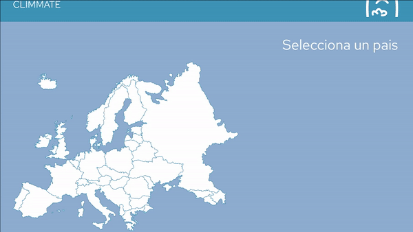
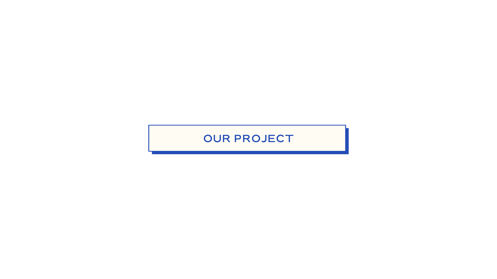

# 🥦 NetZeroCities

Welcome to the NetZeroCities (NZC) Project. Lined up in the European Commision, NZC is part of "Climate-Neutral and Smart Cities", 1 of the 4 Missions held to transform cities.

* You can know more on the <a href="https://ec.europa.eu/info/research-and-innovation/funding/funding-opportunities/funding-programmes-and-open-calls/horizon-europe/eu-missions-horizon-europe/climate-neutral-and-smart-cities_en#:~:text=EU%20missions%20are%20commitments%20to,ensuring%20soil%20health%20and%20food.">EC Missions </a> website

## 

The main goal of our work is to create requisites and visualizations for cliamte data in cities, with the premise of helping cities to achieve their zero emissions goal.
